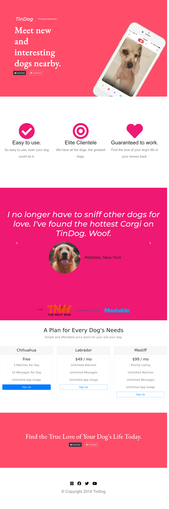

# Project name : TinDog

Welcome to TinDog! TinDog is a static website built using Bootstrap that connects dog lovers and helps them find their furry companions in a fun and interactive way.

## Description

TinDog is designed to make it easy for dog enthusiasts to discover, connect, and arrange playdates with adorable dogs in their local area. Whether you're looking to adopt a dog, make new furry friends, or simply appreciate different dog breeds, TinDog provides a platform to explore and interact with dogs.

## Demo 

You can see the live demo of TinDog.

## Technologies Used

TinDog is built using the following technologies and tools:

- Bootstrap
- HTML5
- CSS3

## Features

- Browse and explore a collection of dogs available for adoption or playdates.
- View detailed profiles for each dog, including photos, descriptions, and contact information.
- Filter dogs based on breed, size, or other characteristics to find the perfect match.
- Engage in interactive features and functionalities to enhance the user experience.

## Installation

To run TinDog locally, follow these steps:

1. Clone the repository: `git clone https://github.com/ashwintelmore/tingog.git`
2. Navigate to the project directory: `cd tindog`
3. Open the index.html file in a web browser.

## Usage

Upon opening TinDog, you will see a curated list of dogs available for adoption or playdates. You can browse through their profiles, view their photos, read descriptions, and find contact information to get in touch with the dog owners. TinDog provides a platform for dog lovers to connect, make new friends, and explore opportunities to spend time with furry companions.

## Contributing

I welcome contributions, suggestions, and feedback for improving TinDog. If you have any ideas or find any issues, please open an issue or submit a pull request.

## Contact

If you have any questions or feedback, feel free to reach out to me:

- Email: [developer@ashwintelmore.com](mailto:developer@ashwintelmore.com)
- LinkedIn: [LinkedIn Profile](https://www.linkedin.com/in/ashwintelmore/)

Thank you for visiting TinDog! Enjoy connecting with adorable dogs and fellow dog lovers!
